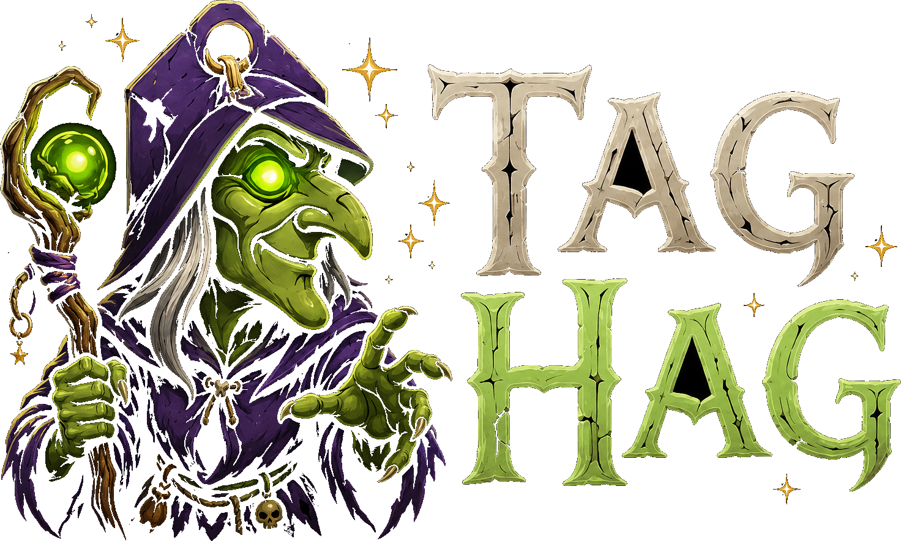

<p align="center">
  
</p>

<h1 align="center">The Tag Hag</h1>
<p align="center"><em>Tame the AI image hoard.</em></p>

A portable, single-file **Windows desktop app** for managing a large local library of AI-generated images. Point it at your folders and it scans them, reads the embedded **A1111 / ComfyUI / EXIF / sidecar** generation metadata, indexes everything into a local **SQLite + FTS5** database, and lets you **search, sort, and sift thousands of images by their prompt tags** — then organise, optimise, or export them. Built to stay smooth at **100k+ images** (verified at ~28,600).

> Local-first, single-user, portable. No cloud, no account, no telemetry.

## Download

Grab **`TheTagHag.exe`** from the [**Releases**](https://github.com/AngryMunky/tag-hag/releases/latest) page — one self-contained file. No installer, no .NET required; just run it.

## Features

- **Scan** multiple source folders recursively, with a live **0–100% cancelable progress** overlay; incremental re-scans skip unchanged files and prune deleted ones.
- **Read generation metadata** from A1111 `parameters`, ComfyUI prompt graphs, JPEG/WebP EXIF, and `.txt` sidecars.
- **Search** by prompt tags with type-ahead autocomplete (the "prompt matrix"): comma = AND, `"quotes"` = exact phrase.
- **Gallery** with virtualized infinite scroll and a lazy 512px WebP **thumbnail cache** for fast load at scale.
- **Inspector panel** + lightbox showing positive / negative prompt, checkpoint, LoRAs, sampler / steps / CFG / seed, with copy buttons.
- **Personal knowledge management** — **Favorites**, per-image **Notes**, and **manual tags** that blend into the same search as the prompt tags. None of it is wiped by a re-scan.
- **Collections**: group images into named, **nested** logical sets. Build a hierarchy in the sidebar, then **Consolidate by collection tree** to write that hierarchy to disk — one definitive home per image; uncollected images land in `_Uncollected`.
- **Potions** 🧪: save any search as a named "Potion" — a reusable filter you can recall from the sidebar instantly. Auto-seeded from your most-used tags on first run; full CRUD with undo.
- **Auto-Tag** (suggest-only): proposes tags for an image from its visually-similar neighbours; you approve each one.
- **Find Duplicates** by perceptual hash — exact and near-match.
- **Folders**: your imported subfolders show up as a browsable sidebar tree — rename or move a folder in-app and the library follows on disk.
- **File-manager action bar**: multi-select (incl. **Ctrl+A to select the entire current view**, not just the loaded page), then **Move / Rename / Delete**, bulk **Favorite**, or **Add to Collection** — or **drag images straight onto a folder** in the sidebar to move them there on disk. In-library moves keep every image's favorites / notes / tags / collections attached.
- **State-preserving re-link**: reorganise or rename files in Explorer and Tag Hag re-attaches all that user state on the next scan, matching moved files by perceptual hash.
- **Library Optimization**: resample large images into a Tag-Hag-managed store that mirrors your source tree, then recycle the originals to reclaim disk — for one image, a selection, or the **whole library**. Format-preserving (no transcode), metadata-preserving, idempotent, with a preview tally before it runs.
- **Export & cull**: bulk **Copy** into a confined export tree, **Archive** to the Bog, or **Delete** (Recycle Bin — recoverable).
- **Civitai mode**: browse the live feed (period / sort / NSFW / min-likes / *Followed only*), react inline, and pick images to import into the library.
- **Dark Magic Pro** look: a 3-pane shell with a witch-hat brand, Cinzel + Inter type, and the hag-tag app icon.

## Build & run

Requires the **.NET 8 SDK** (Windows). The shipped exe is self-contained — end users need nothing installed.

```sh
# Debug build
dotnet build TheTagHag.csproj -c Debug

# Release: one self-contained, single-file win-x64 exe → publish\TheTagHag.exe
dotnet publish TheTagHag.csproj -c Release -o publish
```

> The running app holds `publish\TheTagHag.exe` — close it before re-publishing or the build fails on a file lock.

Tagged releases (`v*`) build automatically via GitHub Actions, which publishes the same single-file exe and attaches it to the GitHub Release.

## Tests

The engine has a headless self-test harness (the GUI is verified in-app). Each prints `RESULT: PASS/FAIL`:

```sh
TheTagHag.exe --selftest          # SQLite + FTS5 smoke test
TheTagHag.exe --selftest-scan tests\fixtures
# feature suites: -db -dupes -v4migrate -v5migrate -optimizelib -optindicator -relink
#                 -folders -filemanager -favorites -notes -usertags -collections -autotag
#                 -selectall -scanprogress -collnest -collconsolidate -potions
```

Regenerate the app icon from the brand mark:

```sh
TheTagHag.exe --makeicon Resources\app.ico design\ui-redesign\assets\logo-mark.png
```

## Tech stack

C# / .NET 8 · WinForms + WebView2 (HTML gallery) · SQLite + FTS5 (`Microsoft.Data.Sqlite`, WAL) · SixLabors.ImageSharp · DPAPI-encrypted API key · single-file self-contained win-x64 publish.

## License

[MIT](LICENSE) © Angry Munky
